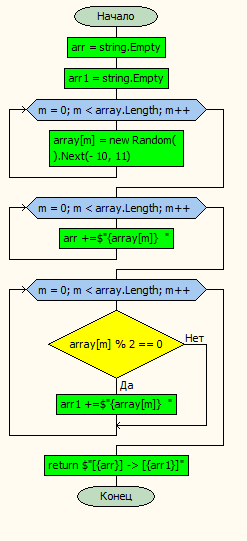

# Задача
Написать программу, которая из имеющегося массива целых чисел формирует массив из четных чисел.
Первоначальный массив можно ввести с клавиатуры, либо сгенерировать случайным образом. При решении не
рекомендуется пользоваться коллекциями, лучше обойтись исключительно массивами.

## Решение задачи
1. Cоздаем одномерный массив *array*, состоящий из 8 целых чисел.
2. Объявляем метод типа *string* под названием *EvenNumbers*, принимающий массив *array*.
    1. Заполняем массив *array* произвольными числами из интревала [-10, 10].
    2. Собираем в переменную *arr* наш массив.
    3. Собираем в переменную *arr1* массив, состоящий из четных чисел массива *arr*.
    4. Возвращаем оба массива. 
3. Выводим на экран результат работы метода *EvenNumbers*.

## Блок-схема метода *EvenNumbers*

